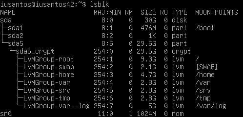
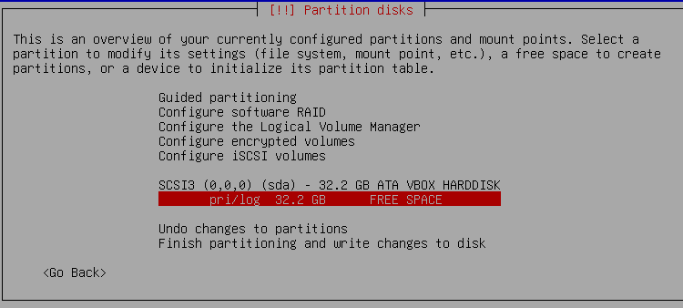
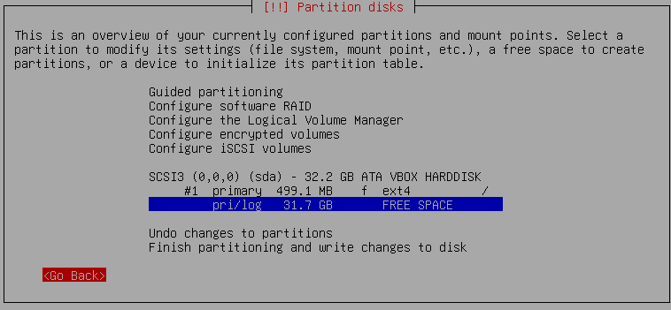
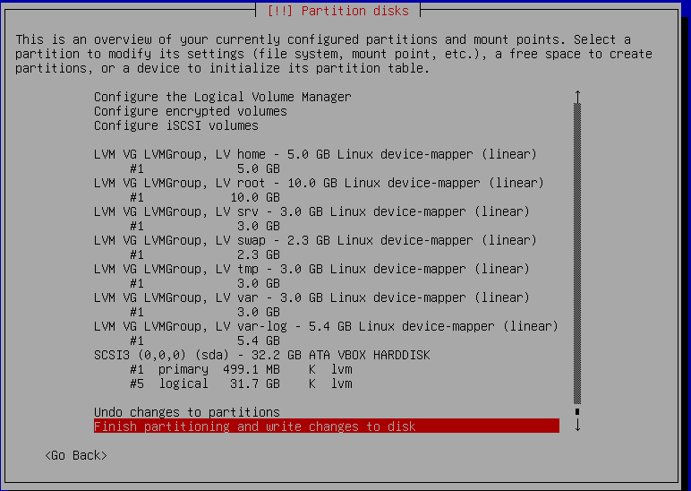
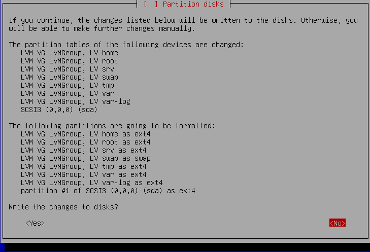

# Born2beroot ROADMAP

In this file I'll document the necessary steps to attain the Virtual Machine compliant to the project requirements.

We'll use the Debian 12 (codename _bookworm_) distribution. An .iso file can be downloaded [here](https://www.debian.org/download).

## 1. Creating the VM
Using Oracle Virtual Box, let's create a nem Virtual Machine with the following characteristics:
- Linux Debian distribution
- 2GB (aka 2048MB) RAM
- 30GB HD (after creating a new virtual disk, specifically a VirtualBox Disk Image). It is advisable that this file to be dinamically allocated.

## 2. Booting the VM for the first time
As of now, the VM is created, but it is not operational. When we boot it the first time, we'll have to install the operating system following the project's requirements.

Immediately after booting, VirtualBox will ask us to point to the relevant .iso file. Then we'll begin the installation process.

### 2.1 Select the install mode
The installation programa will prompt us to select one installation mode. Let's not use the Graphical Interface. **Select Install**
After that, select appropriately the language, keyboard and timezone options. We'll use English language, Brazil/SP timezone, and brazilian keyboard layout.

#### Hostname
The system we are installing must have a name that identifies it to the network. As per project's requirement, it's name must be our login followed by 42. In my case, the hostname is iusantos42. No domain name is necessary.

#### Root password
Now we must configure the root user (a kind of master user) password.

#### Create normal user
The system prompts us the give a full name, user name and password for a normal user. Since the project requires that a user with our login to be present, I'll create a user called iusantos.

### 2.2 Partitioning the Hard drive
As of now, our (virtual) hard drive is completely empty. We have to configure it to have the format specified in the project. Consider the image below:

.

For pedagogical reasons, we'll not use the guidance provided by the installer. We'll do it manually.

#### Select the block device that will be partitioned
First of all, we have to select the (virtual, in this case) storage device that will be partitioned. In our case, we have to select `SCSI3 (0,0,0) (sda) - 32.2 GB ATA VBOX HARDDISK`. After pressing Yes in the next window, we'll be presented with the following image:

What the image says is: the device `VBOX HARDDISK` has the partition pri/log with 32.2 GB of Free Space.

Now we have to partition this pri/log partition adequately.

#### First Partition (/boot)
Pressing ENTER when the pri/log line is selected will present us with the option to `Create a new partition`. The first partition we'll create will be used to store the files that the VM will use to boot up. **Let's set 500MB to this. (500M in the selected field)**. After setting the size, we'll need to select the type of partition. **Select Primary**. This means that this partition will be _bootable_ (accessed by the BIOS or UEFI). **Location: beginning**

Now the system knows that we have a 500MB partition. We need to provide a filesystem to this partition, as well as define a mountpoint. The filesystem will be ext4 and the mount point for this partition is **/boot**. Now we're `Done setting up this partition`.

Notice that now the pri/log partition has a shorter size (exactly the 500MB that we allocated to the previous partition). See the picture below:

#### Encrypting the rest of the device
To comply with the projects requirements we must now encrypt the rest of the device and, after that, create Volume Group and logical partitions. To encrypt the device, select the option `Configure encrypted volumes` -> `Yes` -> `Create encrypted volumes` and select `/sda/dev/`, which refers to the partition with the Free Space. Now we're `Done Setting up the partition`. After setting writing the partition table to disk, we must press `Finish`.

The installer will now prompt you to press `Yes`. This will begin to populate the partition with random data. (this loading can be cancelled at any time, but this will make the encryption somehow weaker).

Now you will need to choose and confirm a passphrase so that you can access the encrypted data.

#### Creating Volume Group and logical partitions
Now we have the following situation. Our (virtual) storage device has:
- A primary partition of 500M
- An encrypted partition of 31.7GB.

We now have to separate this second partition into different **logical** partitions beloging to the same _Volume Group_. For this me must select the `Configure the Logical Volume Manager` option, then `Yes`. Next we have to create a `Create a Volume Group` and, for this project, we'll call it LVMGroup. Next, we have to identify which device will be part of this volume group we created. In this scenario, we must select only the encrypted device (it's likely called /dev/sda5) then `Yes`.

Now we must create the logical partitions with the adequate sizes. The procedure is the same for all the logical volumes (root, home, srv, var, tmp, var-log and swap).

- `Create Logical Volume` -> Select the LVMGroup -> Type the logical volume name (for example root) -> Type the logical volume size.

After doing this _busywork_, our situation is the following: our harddrive is divided in two physical partitions: the primary and the other. The other is an encrypted partition that has 7 logical partitions (all of them are part of the LVGroup Volume Group). Se the image below:

#### Mounting partitions
Now that our 'hardware' part is set, we need to teach the OS how to navigate to the relevant hardware parts. I understand that this is what mountpoints are for (but i need to study this better).

To set the mountpoints, we need to select the physical partition of the primary partition and each of the logical partitions. After selecting each option, we need to:
- `Use as: ext4` (select the filesystem) and
- select the mount point (accordingly)

obs1.: for the logical partition var-log we need to manually type /var/log
obs2.: for the swap partition, we select 'swap area' when choosing the `Use as` option

We are now ready to `Finish partitioning and write changes to disk`. Check the image below.

#### Next steps
After some loading screens, you'll be prompted to select:
- additional boot devices (there are none in this scenario)
- apt mirror (just choose Brazil's deb.debian.org)
- if you wish to participate in package survey (whatever)
- Sofware selection: select ONLY 'SSH server' and 'standard system utilities'
- If you want to install GRUB on the primary device. SELECT YES. Then select /dev/sda.

## 3. Setting up sudo policy and including first users
Now that our Virtual Machine is ready, we need to config our system do comply with the other subject requirements. The first thing we'll do is install the program `sudo`.

As of now, our system has two users: root and iusantos. iusantos cannot install packages or programs to other users (we'll use sudo for that, but we do not have sudo yet). **So, first of all, let's log as root.**

After that, use the followings commands:
- `apt update` so that the package manager can use the repositories listed in /etc/apt/sources.list to update information about packages.
- `apt install sudo` so that the package manager can download and install the programa sudo.

So now we have sudo installed. sudo uses basically two files to know how to behave: `/etc/sudo.conf` which deal of plugins (we will not use this file in this project) and `/etc/sudoers` which defines the policies used by the program. These are text files, but we must not edit them using simple text editors. We must use the program `visudo` (which will call a text editor) that will garantee no concurrent edits and will check syntax.

### New policy file and its content
Because the last line of our `/etc/sudoers` file is "@includedir /etc/sudoers.d", the sudo program will consider (in a lexical order) all files in this folder and apply policies set there. So, in order to preserve our original sudoers let's create a new file: use the command (as root) `visudo /etc/sudoers.d/00_b2br` to create and edit this new sudoers file.

Now we implement the policies required by the project subject:
- Setting secure path: `Defaults    secure_path="path from the subject"`
- Limiting number of password tries: `Defaults  passwd_tries=3`
- Custom message if user mess up password typing: `Defaults badpass_message="message"`
- Custom message after authentatican fail: `Defaults    authfail_message="message"`
- Enable input logging: `Defaults   log_input`
- Enable output logging: 'Defaults  log_output`
- Setting path to dir where logs will be stashed: `iolog_dir="/var/log/sudo"`. This command is necessary because default log dir is different than required by project subject. And if you do no use this command, you will have to created the directory before using sudo, in other case, an error will be thrown.
- Setting logfile name: `Defaults   logfile="/var/log/sudo/sudo.log"`
- Require terminal mode for sudo: `Defaults requiretty`

### Inserting an user to sudo group
Now that our sudo policy is read, let's put the user iusantos in the sudo group. To do that run the command (as root):
- `adduser iusantos sudo`

## 4. Creating a new group and inserting an user there
The project subject stipulates that the user with our login has to be in a group called `user42`. This group still does not exist, so we must create it. To do that, **as root** you should run the following command:
- `addgroup user42`
And to insert user iusantos there, run the following command:
- `adduser iusantos user42`

## 5. Password Policy
To implement the subject's required password policy we'll have to deal with two files and install a new Plugable Authentication Module.

First of all, let's make some changes to the file /etc/login.defs. This file governs some configutations for the login package, including the age requirements. We'll have to modify the lines containing the following expressions:
- `PASS_MAX_DAYS`
- `PASS_MIN_DAYS`
- `PASS_WARN_AGE`

Next, to implement the projects' password complexity requirements, we'll have to install a new Plugable Authentication Module using apt. A PAM is a shared library that installed packages can use to implement certain security measures. So, let's install the pam module using `sudo apt-get install libpam-pwquality`. Open the file /etc/pam.d/common-password.

In the line containing "password requisite pam_pwquality.so", we will add, *ON THE SAME LINE*, the following options: `minlen=10 lcredit=-1 ucredit=-1 dcredit=-1 maxrepeat=3 usercheck=1 difok=7 enforce_for_root`. Each of this option implements an specific subject requirement.

## 6. Uncomplicated Firewall
To install the solicited firewall, let's use the usual command: `sudo apt-get install ufw`.

After installation, let us tell our system to always run ufw on startup and, also, to start it immediately:
- `sudo systemctl enable ufw && sudo systemctl start ufw`

To check if our commands work, you can use `sudo systemctl status ufw`.

To tell ufw that all traffica is permitted via port 4242, we'll use the command: `sudo ufw allow 4242`. And to check the result, use `sudo ufw status`.

## 7. Installing and setting SSH
When we installed our OS in the virtual machine, we already installaed SSH along with the minimal requirements. If we did not do this, we could use apt to install it. The command would be `sudo apt-get install ssh`. As it is a service, we'll need to enable & start it, as we did with ufw. To do that use `sudo systemctl enable ssh && sudo systemctl start ssh`.

The project's subject requires that SSH only operates via port 4242 and that root login is prohibited via ssh. To implement this measures we'll need to change the /etc/ssh/sshd_config file:
- Uncomment the line containing `Port 22` and change 22 to 4242.
- Uncomment the line containing PermitRootLogin and add a `no` to it: `PermitRootLogin no`

## 8. Periodic Script Running
### 8.1 Setting periodic Jobs
The subject requires that a script callend monitoring.sh is run every 10 minutes after the system bootup. Before dealing with the script itself, let us tackle the problem of making our system perform a task periodically. To do this, we'll use cronjobs.

Cron is a job scheduler that after consulting adequate crontab files, will perform tasks defined in the file. As we did with sudoers, crontabfile are best not edited directly via a text editor, but using the crontab program with the `-e` flag.

To understand the proper formatting of a crontab file check `man 5 crontab`. Note that crontab files do not deal with intervals. The times set are literal, meaning that the system will match the time set with the system clock. So, if in the first time placeholder we put a 10, this does not mean every 10 minutes, but at the 10th minute of every hour of every day (considering the other time placeholders are all *). It is also possible that cronjob runs a task in each minute that ends with a zero. To do this, we can use the notation */10 in the first time placeholder.

So we'll need to deal with this, since our script must run once every ten minutes. If our system bootup time is 10h23, the script must run até 10h33, 10h43, etc. To implement this, we'll need to _delay_ the execution somehow. Since the cronjob (with the notation */10) will run at every minute ending with zero, we need to delay the execution (in this specifi case) for 3 minutes. So, when we get to 10h30, we can call the program sleep (for 3 minutes) and then execute our required task.

To capture the number of minutes of the time of the bootup, we can feed `uptime --since` to awk and select the unit of the minutes number. The following script does this:

`bash
#!/bin/bash
minutes=`uptime --since | awk 'BEGIN {FS="[ :]"} {print $3}' | grep -o .$`
total_seconds=$((minutes * 60))
sleep $total_seconds
source /bin/monitoring.sh | wall
`
